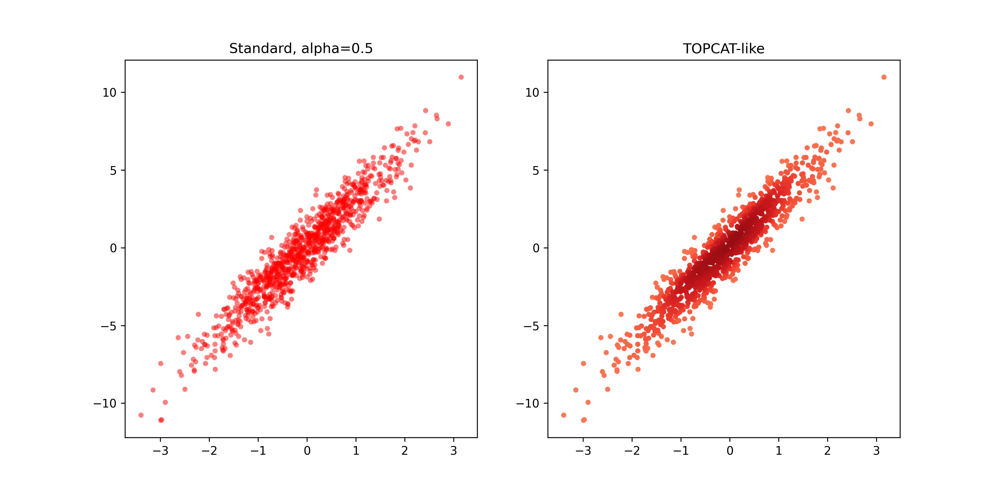

# topcat_scatter_python
This repository includes code that will create scatter plots that resemble TOPCAT plots, particularly in how the density map appears.
This code was adapted from the following sources:
https://stackoverflow.com/questions/50526344/points-with-density-gradient
https://stackoverflow.com/questions/20105364/how-can-i-make-a-scatter-plot-colored-by-density-in-matplotlib

TOPCAT_density_demo.ipynb contains the code and demonstrates its use.

