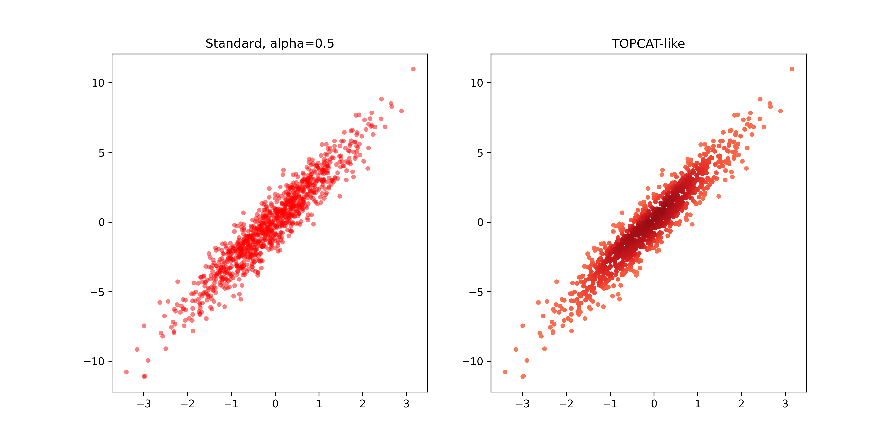

# topcat_scatter_python

A set of utilities to create scatter plots in Python that resemble [TOPCAT](http://www.star.bris.ac.uk/~mbt/topcat/) plots. This code was adapted from these two sources: [Source1](https://stackoverflow.com/questions/50526344/points-with-density-gradient), [Source2](https://stackoverflow.com/questions/20105364/how-can-i-make-a-scatter-plot-colored-by-density-in-matplotlib).

---

## Requirements

* Python 3.8 or higher
* Dependencies below are listed in `requirements.txt`:
  * numpy 1.20.0 or higher
  * scipy 1.10.0 or higher
  * matplotlib 3.3.0 or higher

Install dependencies using pip:
```shell
pip install -r requirements.txt
```

---

## Installation

Clone the repo and install dependencies:
```shell
git clone https://github.com/AnnaOG/topcat_scatter_python.git
cd topcat_scatter_python
pip install -r requirements.txt
```

---

## Features and Comparison

* Calculates point density using Gaussian KDE and sorts points so the densest regions appear on top
* Truncates colormaps to avoid washed-out colors
* Convenience function for quick plotting
* Handles NaN and inf values with warnings

A demo of the features is included in [`TOPCAT_density_demo.ipynb`](./TOPCAT_density_demo.ipynb).



## Functions Overview

### calculate_density

```python
calculate_density(x, y, bandwidth=None)
```

#### Inputs

* `x, y` (array-like): X/Y coordinates of points
* `bandwidth` (float, optional): Bandwidth for `gaussian_kde`. If None (default), it will be estimated automatically.

#### Returns

* `x_sorted, y_sorted, densities` (array-like): X/Y coordinates and density values, sorted from least to most dense.
* Raises `ValueError` if x and y have different lengths, if there are fewer than 2 points, or if bandwidth is non-positive.

### truncate_colormap

```python
truncate_colormap(cmap, minval=0.4, maxval=0.9, n=256):
```

#### Inputs

* `cmap` (matplotlib.colors.Colormap OR str): The original colormap to be truncated. Can be a colormap object or a string name of a colormap.
* `minval` (float, default=0.4): The minimum value of the colormap to include (between 0 and 1).
* `maxval` (float, default=0.9): The maximum value of the colormap to include (between 0 and 1).
* `n` (int, default=256): The number of discrete colors to generate in the truncated colormap.

#### Returns

* `LinearSegmentedColormap`: The truncated colormap.
* Returns `ValueError` if minval is greater than maxval or if either is outside the allowed range.

### plot_density_scatter

```python
plot_density_scatter(x, y, bandwidth=None, cmap='Reds', minval=0.4, maxval=0.9, n=256, ax=None, **scatter_kwargs):
```

#### Inputs

* `x, y` (array-like): X/Y coordinates of points
* `bandwidth` (float, optional): Bandwidth for `gaussian_kde`. If None (default), it will be estimated automatically.
* `cmap` (matplotlib.colors.Colormap OR str): The original colormap to be truncated. Can be a colormap object or a string name of a colormap.
* `minval` (float, default=0.4): The minimum value of the colormap to include (between 0 and 1).
* `maxval` (float, default=0.9): The maximum value of the colormap to include (between 0 and 1).
* `n` (int, default=256): The number of discrete colors to generate in the truncated colormap.
* `ax` (matplotlib.axes.Axes, optional): Axes object to plot on. If None, uses current axes.
* `**scatter_kwargs` (keyword arguments, optional): Additional keyword arguments passed to plt.scatter().

#### Returns

*  `scatter` (matplotlib.collections.PathCollection): The scatter plot object.

---

## Usage Options and Tips

* See [`TOPCAT_density_demo.ipynb`](./TOPCAT_density_demo.ipynb) for full demo
* Leave `bandwidth=None` for automatic estimation (recommended for most cases)
* Adjust `minval`/`maxval` (default 0.4-0.9) to control colormap brightness
* Use `edgecolor='none'` for cleaner appearance (default in convenience function)

### 1. Quick Plot

```python
from topcat_scatter_utils import *
import numpy as np

x = np.random.randn(5000)
y = x * 3 + np.random.randn(5000)

plot_density_scatter(x, y)
```

### 2. Separate Functions (More Control)

```python
from topcat_scatter_utils import *
import numpy as np
import matplotlib.pyplot as plt

x = np.random.randn(5000)
y = x * 3 + np.random.randn(5000)

# Sort data
x_sorted, y_sorted, density = calculate_density(x, y)
# Truncate colormap
cmap_t = truncate_colormap('Purples',0.4,0.9)

# Plot
plt.scatter(x_sorted, y_sorted, c=density, cmap=cmap_t, s=20, edgecolor='None')
```
